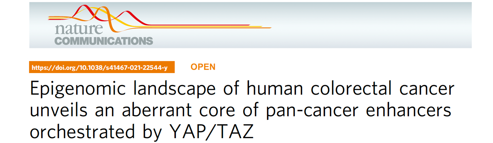
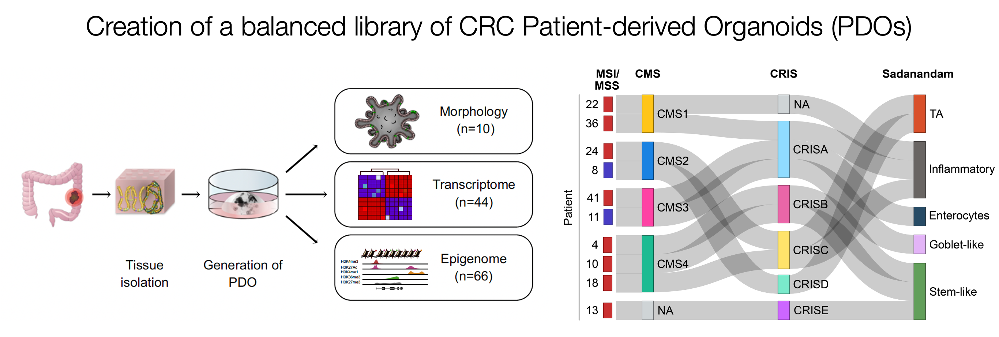
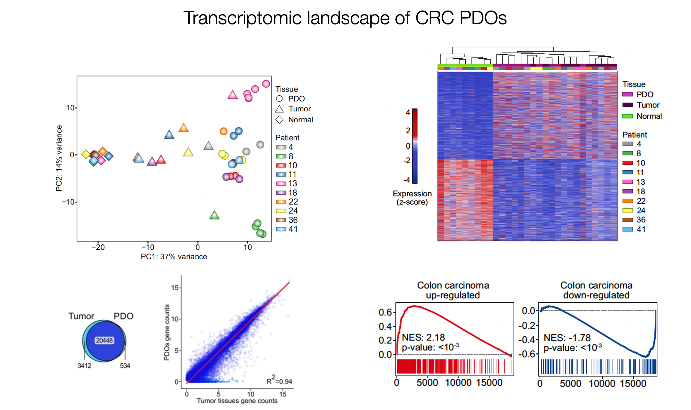
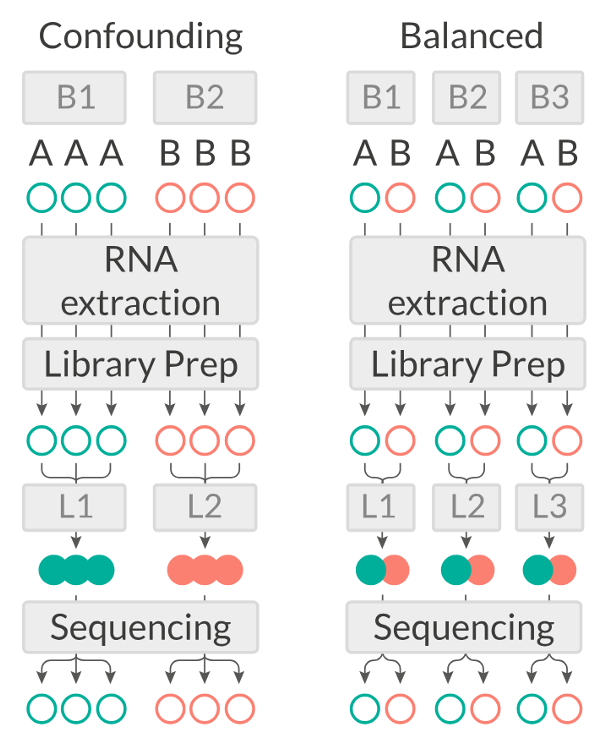
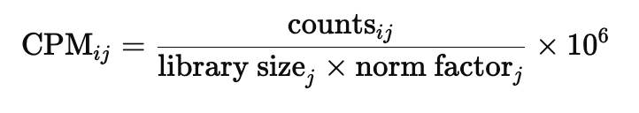

## Objectives

-   Introduction to RNA-seq
-   Dataset introduction and exploration
-   Data normalization with `edgeR`
-   Diagnostic and exploratory analysis
-   Differential analysis
-   Visualization of results

## Install the packages

If you haven't already installed the packages as part of the `Intro_to_R` tutorial, run the following chunks.

```{r, eval=FALSE}

install.packages("rmarkdown")
install.packages("knitr")
install.packages("BiocManager")

```

During installation of packages, you will see many messages being displayed on your R console, you usually need to pay attention to them if they are **red and specify an error**!

If you encounter any of the messages below during installation, follow this procedure here:

```{r, eval=FALSE}
# R asks for package updates, answer "a" and type enter
# Question displayed:
Update all/some/none? [a/s/n]:

# Answer to type:  
a

# R asks for installation from binary source, answer "no" and type enter
# Question displayed:
Do you want to install from sources the packages which need compilation? (Yes/no/cancel)

# Answer to type:
no
```

```{r, eval=FALSE}

#Install packages from CRAN
install.packages("tidyr")
install.packages("dplyr")
install.packages("kableExtra")

# For differential analysis
BiocManager::install("vsn")
BiocManager::install("edgeR")
install.packages("statmod")
install.packages("matrixStats")

# For visualizations
install.packages("hexbin")
#install.packages("ggplot2")
install.packages("pheatmap")
install.packages("RColorBrewer")
install.packages("ggrepel")

# For downstream analysis
BiocManager::install("fgsea")
install.packages("msigdbr")
install.packages("gprofiler2")
install.packages("reshape2")
#BiocManager::install("clusterProfiler")

# Clean garbage
gc()

```

## Load libraries

```{r, include=FALSE}
library(knitr)
knitr::opts_chunk$set(engine = 'R', echo = TRUE, fig.align = 'center', warning = FALSE, message = FALSE, class.output = ".bordered")
```

```{r}
library(knitr)
library(kableExtra)
library(dplyr)
library(tidyr)
library(ggplot2)
library(tibble)
library(reshape2)
```

## Useful commands

Some useful shortcuts to commands we saw in the Intro_to_R

> Run a chunk: `Alt` + `CMD` + `Enter` or just `CMD` + `Enter` for a selected line

> Create new chunk in macOS: `Alt` + `CMD` + `I`

> Create new chunk in Windows: `Alt` + `Ctrl` + `I`

> Comment/Uncomment code: `SHIFT` + `CMD` + `C`

***

## The RNA-seq dataset

The dataset we will analyze comes from this paper published from our lab in 2021:

> Della Chiara, Gervasoni, Fakiola, Godano et al., 2021 - Epigenomic landscape of human colorectal cancer unveils an aberrant core of pan-cancer enhancers orchestrated by YAP/TAZ

<center>

</center>


***

The main research question of the study was the existence of a common layer of epigenetic deregulation across diverse human malignancies.
To address this, we leveraged the organoid technology and generated **organoid lines from patients to model colorectal tumors**.
Using RNA-seq, we **profiled the transcriptome of patient-derived organoids (PDOs)** to show that they closely recapitulate the molecular features of their original CRC.
We also performed a transcriptomic classification of the primary tumor tissues in order to select a library of PDOs that represents interpatient heterogeneity, i.e. encompasses the different molecular subtypes of CRC.
This is because we were interested to identify epigenomic mechanisms of disease that were common to all CRC tumors as opposed to those that are relevant to a specific molecular subtype.





To further explore the way cancer cells use enhancers as opposed to nonmalignant cells, we performed systematic **ChIP-seq on histone marks** and compared it to the ATAC-seq-derived chromatin activity data of multiple other malignancies.
We found a small number of **enhancer sequences were conserved** across all these types, and identified a transcription factor that linked them - the YAP/TAZ pair - that when perturbed would cause the death of malignant, but not normal, organoids, therefore representing a potential pan-cancer therapeutic target.

> ✅ In this Tutorial we will analyse RNA-seq data generated for normal colon tissues, primary tumors, and patient-derived organoids (PDOs) from tumors.
> One of the main goals of the analysis performed in the paper was to show that the transcriptomic landscape of PDOs resembles that of the primary tumors.

## Load and explore the dataset

You can download the data you will need to run this tutorial from the following public Google Drive [folder](https://drive.google.com/drive/folders/1Q4seP47Q0KMtOjHhbdZohp53yx0_p6cT?usp=sharing).
You will find:

1.  `sampleinfo.rds`: a tabular file containing **metadata** related to columns of the count table, which contains different info about our samples (e.g. the sample origin, the patient etc.).
2.  \`rsem.merged.gene_counts.tsv\`\`: the **gene expression or counts matrix** containing the number of reads detected for each gene in each sample.
3.  `gene_annotation.rds`: a GTF file with gene annotations across all chromosomes.

Open the Google Drive link above on the browser, check the presence of the files and download them on your computer.
Create a new directory within your Project Directory `Cloud/project/course_material` to store the data.

Create a new R notebook and save it in a separate folder.
Check the path to the current working directory.
To list the files you have just downloaded, modify the code below according to the directory where you downloaded the data.

```{r, eval=FALSE}
getwd()
list.files("./")
#dir()
```

### Load Samples

```{r, eval=FALSE, include=FALSE}
#setwd("/storage/data/MAP/projects/organoids/bulk_rna-seq/analysis/DEA/")

# Read sampleifo
sampleinfo <- readRDS("../course_material/sampleinfo_orig.rds")

sampleinfo$passage=ifelse(sampleinfo$passage.num=="ps3", "middle", as.character(sampleinfo$passage))
sampleinfo$group=ifelse(sampleinfo$tissue=="organoids", "CRC_org", as.character(sampleinfo$group))
sampleinfo$condition=ifelse(sampleinfo$tissue=="organoids", "K_organoid", as.character(sampleinfo$condition))
sampleinfo$condition2=ifelse(sampleinfo$passage.num=="ps3", "K_middle", as.character(sampleinfo$condition2))


matched=c("CRC4", "CRC8", "CRC10", "CRC11", "CRC13", "CRC18", "CRC22", "CRC24", "CRC36", "CRC41")

# Remove biopsy, normal and early organoids, certain patients
sampleinfo <- sampleinfo[sampleinfo$tissue != "biopsy" & sampleinfo$condition !="N_organoids" & 
                  sampleinfo$patient%in%matched & sampleinfo$passage !="early", ]

sampleinfo=droplevels(sampleinfo)

# SaveRDS
sampleinfo %>% select(-c("Run_seq_date","medium")) %>% saveRDS(., '../course_material/sampleinfo.rds')

```

```{r}
# Read sampleifo
sampleinfo <- readRDS("../course_material/sampleinfo.rds")

```

```{r}
# Check samples
dim(sampleinfo)
head(sampleinfo,4) %>% kbl() %>% kable_styling()

# Tabulate information
sampleinfo %>%  group_by(condition, group) %>% tally() %>% kbl %>% kable_styling()
table(sampleinfo$condition, sampleinfo$patient) %>% kbl %>% kable_styling()
```

```{r}

summary(sampleinfo) %>% kbl %>% kable_styling()

```

### Load gene annotation

```{r, eval=FALSE, include=FALSE}

igenomes=read.table("../course_material/genome_genes.gtf", sep="\t")

igenomes$V9=as.character(igenomes$V9)
igenomes$gene_id <- gsub("gene_id ", "", sapply(strsplit(igenomes$V9, "; "), function(x) x[1]))
igenomes$gene_name=gsub("gene_name ", "", sapply(strsplit(igenomes$V9, "; "), function(x) x[2]))
igenomes$transcript_id=gsub("transcript_id ", "", sapply(strsplit(igenomes$V9, "; "), function(x) x[3]))
igenomes=igenomes[,c(1,10:12)]
colnames(igenomes)=c("chromosome", "gene_id", "gene_name", "transcript_id")
#igenomes=igenomes[-c(grep("_|chrY|chrM", igenomes$chromosome)), ]
igenomes = igenomes %>% unique() %>% droplevels()
dim(igenomes) 
head(igenomes,2) %>% kbl() %>% kable_styling()
```

```{r, eval=FALSE, include=FALSE}
igenomes %>% saveRDS(., '../course_material/gene_annotation.rds')
```

```{r}
igenomes <- readRDS("../course_material/gene_annotation.rds")
```

### Load RSEM raw sequencing counts

```{r, eval=FALSE, include=FALSE}
# Load RSEM matrix, round up counts, and save
RSEM_counts <- read.table("../course_material/rsem.merged.gene_counts_orig.tsv", header = T, row.names = 1)
RSEM_counts <- RSEM_counts[,-1]
RSEM_counts['ZXDA',]
RSEM_counts[,] <- sapply(RSEM_counts[,], round)

RSEM_counts %>% write.table(., "../course_material/rsem.merged.gene_counts.tsv", col.names=T, row.names = T, quote=F, sep="\t")
```

```{r}
RSEM_counts <- read.table("../course_material/rsem.merged.gene_counts.tsv", header = T)
dim(RSEM_counts)
head(RSEM_counts, 4) %>% kbl() %>% kable_styling()
```

Remove genes on chrY, mitochondrial genome and unknown or unresolved genomic regions

```{r}
# Select chromosomes to remove from annotation
chrom2remove <- droplevels(igenomes[(grep("_|chrY|chrM", igenomes$chromosome)), ])
dim(chrom2remove)
table(chrom2remove$chromosome)
```


```{r, include=TRUE}
# Remove them from the RSEM dataset
RSEM_counts <- RSEM_counts %>% 
  filter(!rownames(.)%in%chrom2remove$gene_id)

#RSEM_counts <- RSEM_counts[!rownames(RSEM_counts)%in%chrom2remove$gene_id,]

dim(RSEM_counts)

```

Check that the samples in sampleinfo are present in RSEM Is the opposite true?

```{r}
samples_rsem <- (unique(names(RSEM_counts)))

table(sampleinfo$sample%in%samples_rsem)
table(samples_rsem%in%sampleinfo$sample)
```

Subset the RSEM dataset to retain counts only for the samples present in the sampleinfo dataset.

```{r}

RSEM_counts_sub <- RSEM_counts %>%
  select(all_of(rownames(sampleinfo)))

#RSEM_counts_sub <- RSEM_counts[,colnames(RSEM_counts)%in%sampleinfo$sample]

dim(RSEM_counts_sub)
head(RSEM_counts_sub,2) %>% kbl() %>% kable_styling()

```

## Saving/Loading Files

**Let's save this object with samples information** in a file format where columns are separated by commas.
You might be familiar with this format if you have worked quite a bit in Excel.
In `R`, we can save tabular data with the `write.table()` function specifying the location (the file name) we want.
This is **useful in the case our `R` session dies or we decide to interrupt it**.
In this case we will not have to run the whole analysis from the beginning and we can just source the file and load it!

```{r}
write.table(sampleinfo, "../course_material/samples_table.csv", sep = ",", quote = FALSE)
```

We can **load the object back into the current session** by using the following code line:

```{r}
sampleinfo <- read.table("../course_material/samples_table.csv", sep = ",")
```

Repeat the same for the counts.
>In this case save it as an RDS Object, which is R's binary format. 
>This format preserves the R object structure, it stores complex objects, it's faster to read/write, and takes up less space. The caveat: it is not human-readable (binary).

```{r}
saveRDS(RSEM_counts_sub, "../course_material/counts_table.rds")
```

```{r}
# Load the data again
RSEM_counts_sub <- readRDS("../course_material/counts_table.rds")

```

**! Troubleshoot**

> Where are you?
> Where is the file located?
> Check the current directory and navigate through the folders with `getwd()` and `list.files("./")` or `dir()`

***

## Data Normalization: removing uninteresting differences

To highlight relevant biological differences between groups of samples in our dataset, we first need to take into account and minimize all of the *uninteresting* differences between samples.
This is accomplished by **normalizing the data**, a mandatory step before any differential analysis, if we want to make counts **comparable both across samples or across different genes**, without any unwanted *bias*.

The main differences in the dataset that we want to normalize for are:

1.  the **Sequencing Depth** (expressed as the total amount of uniquely mapped reads in a sample): even between samples that were sequenced in the same sequencing run as part of the same experiments (but even more likely if samples have been generated in **multiple *batches***), differences in the sequencing depth are expected. It's important to take this into account because differences in sequencing depth can erroneously lead to the perception of genes displaying differential expression.

<center></center>

2.  **Genomic interval length**: this is a potential bias if we want to **compare across group of intervals** other than across samples. Indeed, the larger the genomic region, the higher the amount of reads that will be counted on it, and viceversa.

<center></center>

During the years, **many approaches** to data normalization have been developed.
In the table below, we summarized three common methods that can be employed to account for differences in library size (i.e. the sequencing depth) and the genomic interval length.

| **Normalization Method** | **Accounted Factors** | **Description** |
|------------------------|------------------------|------------------------|
| CPM (counts per million) | Sequencing depth | Counts scaled by total read number |
| TPM (transcripts per million) | Sequencing depth and gene length | Counts per length of transcript (kb) per million mapped reads |
| FPKM/RPKM | Sequencing depth and gene length | Counts per kilobase of exon mapped reads per million mapped reads |

> Notice the term "transcript" for TPM or "exon" in the method descriptions.
> Historically, these methods have been developed for RNA-seq data, dealing with **gene expression counts**, but they can be extended for other sequencing technologies.

CPM, TPM and FPKM/RPKM are considered **simple normalization methods**, that can be useful to scale NGS data.
However, newer and more sophisticated approaches have been developed to take into account technical variability and sample-specific biases.
Two of these are the **DESeq2's median of ratios** and the **edgeR's trimmed mean of M values**.
These are indeed more **advanced statistical methods** used for normalization and differential analysis in multiple sequencing data, including RNA-seq and ATAC-seq.

| **Normalization Method** | **Accounted Factors** | **Description** |
|------------------------|------------------------|------------------------|
| *DESeq2*'s median of ratios^[1](https://bioconductor.org/packages/release/bioc/html/DESeq2.html)^ | Sequencing depth and RNA composition | Counts are divided by a sample-specific size factor |
| *edgeR*'s trimmed mean of M values^[2](https://bioconductor.org/packages/release/bioc/html/edgeR.html)^ | Sequencing depth, RNA composition and gene length | Weighted trimmed mean of the log ratio of expression between samples |

As you can see from the table, with respect to the other methods, these ones can correct for one additional unwanted difference across libraries:

3.  **Composition Bias**: these refer to differences in the composition of sequences across libraries that can arise due to a few highly differentially expressed genes between samples, differences in the number of genes expressed between samples, or presence of contamination.

**Highly expressed genes consume more sequencing resources** and thereby **suppress the representation of other genes**.
Scaling by library size fails to correct for this as composition biases can still occur in libraries of the same size.

In the example below, the majority of counts for sample A is related to the differentially expressed gene and therefore this might cause other genes in that sample to be normalized by this high number of counts, resulting in them appearing to be expressed at a lower level as opposed to the same genes in sample B.

<center></center>

Out of all these, we will use one of the more advanced ones provided in the `edgeR` package which will be now introduced.

## About the `edgeR` Package

### Introduction

To identify genes that are differentially expressed in CRC tumors compared to normal organoids, we will compare transcription levels across samples and **statistically assess and quantify differences** arising between the conditions of interest (i.e., **normal colon crypts and CRC tumors**).

`EdgeR` is a widely used package for normalization and differential analysis on bulk sequencing data.

> **Detailed explanations of the statistical procedures implemented in the package are available in the package's [*vignette*](https://bioconductor.org/packages/release/bioc/html/edgeR.html).**

We will start by loading the packages.

```{r}
# Load the package
library(edgeR)
```

You can have a look at all the functions contained in the `edgeR` package by typing the following command:

```{r}
# This should open a popup window in the lower right part of the screen displaying the functions in the package
??edgeR
```

```{r, eval=FALSE, include=FALSE}
edgeRUsersGuide()
```

## Create a DGEList object with counts, sample metadata and design formula

In order for the package to read and understand our data and correctly perform the analysis, we need to **organize our data** in a way that the functions of the package can handle.
This **new object** that we are going to create is called `DGEList` and there is a utility function to create one starting from the *ingredients* we currently have, (1) a table of counts (our RSEM_counts_sub object), (2) a table with sample information (our sampleinfo object) and (3) what comparisons we want to perform, this is called a **design formula**.

### Behind The Design Formula

The design formula should **contain the name of a column of interest in our table of samples** (that we can call **factor**) which stores the information related to the **levels** (or categories) we want to contrast.
Let's say that we have a dataset with two conditions (condition_1 vs condition_2) that we want to compare.
The samples table will look like this, with three replicates for each of the two conditions:

| Sample Code | Patient | Condition   |
|-------------|---------|-------------|
| SA1         | Pt1     | Condition_1 |
| SA2         | Pt2     | Condition_1 |
| SA3         | Pt3     | Condition_1 |
| SA4         | Pt1     | Condition_2 |
| SA5         | Pt2     | Condition_2 |
| SA6         | Pt3     | Condition_2 |

If we are interested in performing a differential expression analysis comparing `condition_1` versus `condition_2`, then our design formula should specify the `Condition` factor.

> 💡 **What is the column that we are interested in when specifying the design formula using in our `sampleinfo` table?**

> 💡 **What is the factor and levels in our case?**

### Paired Analyses and Batch effects

In case your dataset has a source of variability due to **batch effect** or other factors, the design formula is the right place where you can define whether you want to correct for these possible uninteresting differences.

```{r, include=FALSE}

#B: batch, e.g. gender or patient
#B1-B2: levels: male/female or patientID
#A/B: condition A - B

```

<center>

{width="400"}

[Source](https://scilifelab.github.io/courses/ngsintro/1905/slides/rnaseq/presentation.html#7)

</center>

For instance, if you found that in your dataset part of the variability is due to the different patients from which the biological replicates come from, but you want to assess other biologically driven differences due to a certain treatment, you could modify your design formula in order to **check differences due to the treatment, while controlling simultaneously for patient-to-patient variability**.

> In this case, the design formula would be something similar to:

```{r, eval=FALSE}
# Design formula that takes into account also variability across patients
~ patient + group
```

> This design formula works ideally if your dataset is **paired**, that is, there is equal contribution for all the patients to the contrasted condition (i.e., the treatment).

> The optimal setting for the analysis (decided experimentally) is to have paired samples.
> This might be a somewhat difficult concept to grasp, but for our table above this means that every Patient **contributes equally to the two categories** in the Condition columns that we are interested in.
> In this setting, we are fully capable of exploiting the statistics behind the tools we use for differential analysis by correcting for the uninteresting differences arising between patients.
> This aspect greatly helps the analysis and improves the statistical validity of the results.

> Remember, this is something achieved by deciding the experimental setting **beforehand**!
> Ideally this should be done through a collaborative effort between bioinformaticians/statisticians and bench scientists!

Now that we also understand the design formula, we can create the `DGEList` object with the data that we loaded beforehand, but first we need to check that the columns of the `RSEM_counts_sub` table are in the same order of the rows of the `sampleinfo` table, this is important since **we want to be sure that the right levels of expression are associated to the right sample**.

```{r}

# Verify that the samples in the `RSEM_counts_sub` table matches the samples in the `sampleinfo` table.
identical(rownames(sampleinfo), colnames(RSEM_counts_sub))

table(rownames(sampleinfo)==colnames(RSEM_counts_sub))

# What if we reverse the order of the samples? 
all(colnames(RSEM_counts_sub) == rev(rownames(sampleinfo)) )

```

### DGEList object

And now we can build the object:

```{r}
library(edgeR)

# Create a `DGEList` object and call it dds
dds <- DGEList(counts = RSEM_counts_sub, samples = sampleinfo)

dim(dds)
```

And define the design formula:

```{r}

# Create a design formula. Notice that we are creating an object type known as "factor".

groupid <- factor(sampleinfo$group, levels=c("CRC_N", "CRC_K", "CRC_org"))
patientid <- sampleinfo$patient

design <- model.matrix(~ patientid + groupid)

# Let's save the `design` in the dds object
dds$design <- design

design %>% kbl() %>% kable_styling()

```

Remember that `dds` is just a **list** in R which can be updated with different elements.

We can remove the counts table from our R environment since that information is stored in our DGEList object now.
This is useful to save on memory space!

```{r, eval=FALSE}
# Remove original `counts` table to save memory space
rm(RSEM_counts_sub)
gc()
```

Great!
You have created a DGEList object which we called dds, this **contains all the information related to the counts table and the sample information table in one spot**.
We can have a look at the sample information table and the counts table in the dds object:

```{r, echo=FALSE}
# Look at the table with sample information
head(dds$samples) %>% kbl() %>% kable_styling()
```

We can see that some new columns were added to the samples table present in our DGEList object when we created it (the `lib.size` and `norm.factors` columns)!
These will be used by edgeR later on for data normalization!

```{r, include=FALSE}
libs1 <- apply(dds$counts, 2, sum)
class(libs1)
libs1
```

We can also take a look at the table containing the counts, which is just another element of our DGEList object:

> 💡 In R, list elements are accessible with the `$` accessor.
> Our dds object is indeed a list made up of three elements, the counts table, the samples table and the design table, these are accessible using `$` like we did above.

## Filtering Data

Genes with very low counts across all libraries provide little evidence for differential expression.
In addition, the pronounced discreteness of these counts interferes with some of the statistical approximations that are used later in the pipeline.
These genes should be filtered out prior to further analysis.
Users can have their own definition of expression but in general counts are dropped if they are not expressed in a minimum number of samples based on the minimum group size or if it does not achieve a minimum number of counts across all samples.

edgeR provides the `filterByExpr()` function that retains genes with sufficiently large counts for statistical analysis.

```{r}
# Perform filtering, subset the dds object and check the dimensions

# Identify genes with sufficient counts
keep <- filterByExpr(dds, group=dds$samples$group)

# Filter the dds object to keep only these genes
dds <- dds[keep, , keep.lib.sizes=FALSE] # Recomputes the library size since we have removed genes and their counts

dim(dds)
```


## Normalization and Transformation

As we have discussed above, normalization is an integral step to the downstream analysis and necessary for differential comparison.

In this section we will compute normalization factors using the `calcNormFactors` function of the package.
As we have previously introduced, edgeR uses the **trimmed mean of M-values (TMM) method** to calculate a set of **size factors** to **minimize the log-fold change differences occurring between samples** (*uninteresting*) for the majority of genes.

```{r, include=FALSE}
# For each sample, it trims genes with high log2 fold changes from a reference samples, as well as those with extreme expression values (high or low). 
# Then it calculates a weighted mean of the remaining log fold changes.
# The weight comes from the count variance

# “Ignoring genes that are extreme, how much higher or lower is this sample relative to a typical reference?”
# “If I ignore genes that are clearly weird (too DE or too extreme), what is the typical log fold change between these samples?”
# TMM trims genes based on their individual M- and A-values, then computes a weighted mean of the remaining M-values.

# That weighted trimmed mean of Mi becomes the log-scale scaling factor.
# The scaling factor is then converted to a multiplicative factor for the library.
# Normalization factor=2^TMM
# If your factor > 1 → your sample counts are scaled down
# If factor < 1 → counts are scaled up

#For each sample, TMM compares it to a reference sample (often a pseudo-reference, like the library with median composition).
```


The **counts for each sample get then multiplied by the scaling factors** to generate what is referred to as *effective library size (lib.size × norm.factor)*, which will be used for downstream analyses.

### Normalization factors

```{r}
# Call the function to compute normalization factors: "Calculate scaling factors to convert raw library sizes into effective library sizes."

dds <- calcNormFactors(dds)
```

We can check the values of the computed size factors by doing the following, note how there are as many size factors as there are samples and they are inserted in a column of the samples table named norm.factors in our DGEList object:

> 💡 NOTE: Although `edgeR` does not use normalized counts as input for the differential analysis (the normalization process happens inside automatically).
> Normalized counts based on the scaling factors we just generated are useful when plotting results and performing clustering.

After we computed the scaling factors, we can perform a **transformation**.
There are many ways to transform count data but all of them achieve the **goal of removing the dependence of the *variance* on the *mean* counts across samples** (something called *homoscedasticity*) in order to highlight interesting and biologically relevant expression trends even for genes expressed at lower values.
In addition, many downstream analyses (like PCA, clustering, distance calculation) assume homoscedasticity — equal variance across features.
If we do not stabilize for the mean-variance relationship, these analyses will be dominated by highly expressed genes — even if those genes might not be biologically interesting.
Low and moderately expressed genes (which might carry the biological signal) are ignored, because they contribute much less to the variance or distances.


```{r, eval=FALSE, include=FALSE}
# Can you check that the original sequencing depth does correspond to the library size
dds$samples %>% ggplot(aes(x=orig.depth, y=lib.size)) + geom_boxplot()

```


### Log2 transformed counts

We normalize the data using a function provided in the `edgeR` package called `cpm()` which also performs a **logarithmic transformation** which has the effect of reshaping the data to achieve gene-wise distributions which resemble a normal distribution.**The function computes counts per million (CPM) using effective library sizes (lib.size × norm.factor).**

Normalized counts (CPM) using the effective library size are obtained as follows:

`cpm_counts <- cpm(dds, log=FALSE)`

This is equivalent to:

{width="400"}

Where:

counts*ij* = raw read count for gene *i* in sample *j*

library size*j* = total reads in sample *j*

norm factor*j* = edgeR normalization factor (e.g. TMM)

Without getting too much into the details of the workings of the function, we will transform the data and then look at how the gene-wise relationship between the mean and variance in our normalized data changes *before and after the transformation*.
The purpose of this procedure is to allow proper data visualization later in the analysis, **the transformed data is NOT used for the differential expression analysis which instead starts from *raw counts***!

The following code is used to plot the mean/standard deviation relationship of every gene before the transformation.

```{r, include =FALSE, eval=FALSE}

# The figure below plots the standard deviation of the transformed data, across samples, against the mean, using the shifted logarithm transformation, the regularized log transformation and the variance stabilizing transformation. The shifted logarithm has elevated standard deviation in the lower count range, and the regularized log to a lesser extent, while for the variance stabilized data the standard deviation is roughly constant along the whole dynamic range.
# 
# Note that the vertical axis in such plots is the square root of the variance over all samples, so including the variance due to the experimental conditions. While a flat curve of the square root of variance over the mean may seem like the goal of such transformations, this may be unreasonable in the case of datasets with many true differences due to the experimental conditions.

#NOTE!!!: The COUNT legend refers to the number of genes in each bin, in each position, e.g. ouliers, away from the line will have few representative genes, while those close to the line will include many genes.

```

```{r}
library(vsn)

# Plot before data transformation
meanSdPlot(dds$counts)

```

Compute normalized counts for visualization.
The log2 values are returned when `log=TRUE`.

```{r}
# Transform the data with a log2 transform (watch how we create a new variable for it)
log2dds <- cpm(dds, log=TRUE)

```

```{r, eval=FALSE, include=FALSE}
(3) / (17260692*0.9036/1000000)
log2( ((3+2) / (17260692*0.9036/1000000)) )

```

```{r, eval=FALSE, include=FALSE}
norm_counts_cpm <- t(
  t(dds$counts) * 1e6 /
  (dds$samples$lib.size * dds$samples$norm.factors) 
)

all.equal(norm_counts_cpm, cpm(dds, log = FALSE))
```

```{r, eval=FALSE,include=FALSE}
cbind(apply(log2dds, 2, sum),
      apply(dds$counts, 2, sum), 
      apply(cpm(dds, log=FALSE), 2, sum),
      apply(norm_counts_cpm, 2, sum)
      ) %>% head()
```

```{r}
# let's plot the transformed values
meanSdPlot(log2dds)

```

> It is clear how genes with high mean expression (on the right) are now comparable in terms of standard deviation to genes with lower mean expression (on the left).

> After the transformation, the genes with the same mean do not have exactly the same standard deviations.
> The red line shows the experiment-wide trend of SD vs mean The genes with variance above the trend will allow us to cluster samples into interesting groups.

### Visualize count distribution

Let's create some plots to visualize the difference between raw counts and normalized counts.

> 🤔 What kind of plot would be useful to check the distribution of counts? 
> How do we need to reformat the count table to be able to plot all gene counts for each sample?

```{r, eval=TRUE}

dds$counts %>% 
  as.data.frame() %>% 
  mutate(GeneID=rownames(.)) %>% 
  
  # Melt dataframe  
  melt(., id.vars="GeneID", variable.name="sample", value.name = "counts") %>% 
  
  # Merge with sampleinfo to retrieve metadata for our samples  
  merge(., sampleinfo, by="sample") %>%
  
  # Create boxplots  
  ggplot(aes(x=sample, y=counts, colour=orig.depth)) + 
  geom_boxplot(outlier.size = 0.05) + 
  #ylim(0,10000) +
  coord_cartesian(ylim = c(0, 10000)) + 
  theme_classic() +
  theme(axis.title=element_text(size=14), 
        axis.text = element_text(size=10), 
        axis.text.x = element_text(angle = 90, vjust=0.5, hjust = 1))

```

> What can you say about the raw count distribution of the samples?

```{r, eval=FALSE, include=FALSE}

#Samples sequenced deeper have more sequencing reads, their count distribution spans higher values.
#The distribution of counts is unequal between samples.

# Majority of genes are not DE and have low to moderate counts.
# After normalization the MAJORITY of the GENES will ALIGN naturally once adjusted for differences in seq depth.
# So MEDIAN and IQR (middle 50% of expression) end up close, CONVERGE. The median is not affected by a few genes with high values.
# Log2 scale exaggerates the effect.
# Some normalization methods explicitly align distributions: Quantile normalization BUT NOT CPM, TMM, DESEq2

```

<details>
  <summary>**How would you create a function to plot boxplots of counts without repeating the code every time?**</summary>


```{r}

# Function to create boxplots of count distributions

get_count_distribution <- function(data){

data %>% 
  as.data.frame() %>% 
  mutate(GeneID=rownames(.)) %>% 
  
  # Melt dataframe  
  melt(., id.vars="GeneID", variable.name="sample", value.name = "counts") %>% 
  
  # Merge with sampleinfo to retrieve metadata about our samples  
  merge(., sampleinfo, by="sample") %>%
  
  # Create boxplots  
  ggplot(aes(x=sample, y=counts, colour=orig.depth)) + 
  geom_boxplot(outlier.size = 0.05) + 
  #ylim(0,10000) +
  coord_cartesian(ylim = c(0, 10000)) + 
  theme_classic() +
  theme(axis.title=element_text(size=14), 
        axis.text = element_text(size=10), 
        axis.text.x = element_text(angle = 90, vjust=0.5, hjust = 1))
}

```

</details>
\  

```{r}
#| code-fold: true
#| code-summary: "How do you implement the function?"

# raw.counts=dds$counts
# get_count_distribution(raw.counts)

```


```{r}
#| code-fold: true
#| code-summary: "Can you use the function to create similar plots for normalized counts?"

# Which function gives normalized counts without log2 transformation?

```


```{r, eval=FALSE, include=FALSE}
#norm.counts <- cpm(dds, log = FALSE)
#get_count_distribution(norm.counts)

```


```{r, eval=FALSE, include=FALSE}

log2dds[1:100,] %>% 
  as.data.frame() %>% 
  mutate(GeneID=rownames(.)) %>% 
  
  # With pivot_longer, filter first the unwanted columns
  pivot_longer( !GeneID, names_to = "sample", values_to = "value") %>%
  #pivot_longer( cols=SQ_1950:SQ_1951, names_to = "sample", values_to = "value") %>%
  
  # Gather information from all columns except for -GeneID. GeneID remains as separate variable
  #gather(., key="sample", value="value", -GeneID) %>%  
  
  # Gather information from columns SQ_1950 and SQ_1951, retain -GeneID as separate variable
  #gather(., key="sample", value="value", SQ_1950, SQ_1951, -GeneID) %>%  
  #tail()
  ggplot(., aes(value, fill=sample)) + geom_density()

```

***

## Diagnostic Plots of Sample-to-sample Relationships

One way to understand trends in our data and the presence of poor quality or *outlier* samples is to perform exploratory analyses and visualize the results.

Of particular interest is the presence of technical effects in the experiment, such as **batch effects**.

In R in general, **data visualization** is aided by the presence of many packages which can handle diverse data visualization tasks (from traditional plots to visualizing tabular data through heatmaps).
We will use two of these packages, one is `ggplot2` and the other one is `pheatmap`.

### Hierarchical clustering

One of the main strategies for checking the consistency of our dataset is to **cluster samples based on their complete transcriptome profile** (considering all `r dim(dds$counts)[1]` genes in our dataset).
This will allow us to **spot the presence of *outliers* in the data** and **look for consistent gene expression profiles across biological replicates**, which we expect.
Use the code below to **plot a *heatmap* of normalized (and transformed) count values** for our samples.

Since plotting the full count table can be computationally expensive, we might want to subset the number of genes.

#### Perform hierarchical clustering using the most highly expressed genes

```{r, fig.height=5, fig.width=7}
library("pheatmap")

# Take the top 200 genes with the highest mean in the dataset. Returns the index of genes with the highest mean across samples.
select <- order(rowMeans(log2dds),
                decreasing=TRUE)[1:200] # Select number of genes. 

# Create another table for annotating the heatmap with colors
# The rownames of this dataframe correspond to the colnames of the log2dds counts matrix we provide for hierarchical clustering.
df <- as.data.frame(sampleinfo[,c("group","tissue", 'patient')])

# Draw the heatmap using the `pheatmap` package
pheatmap(log2dds[select,], cluster_rows=TRUE, show_rownames=FALSE,
         cluster_cols=TRUE, annotation_col=df)

```

#### Perform hierarchical clustering using the top variable genes

```{r, fig.height=5, fig.width=7}

library(matrixStats)

# Take the top 200 genes with the highest mean in the dataset
select <- order(rowSds(log2dds),
                decreasing=TRUE)[1:1000] # Select number of genes

# Create another table for annotating the heatmap with colors
df <- as.data.frame(sampleinfo[,c("group","tissue","patient")])

# Draw the heatmap using the `pheatmap` package
pheatmap(log2dds[select,], cluster_rows=TRUE, show_rownames=FALSE,
         cluster_cols=TRUE, annotation_col=df, scale='row')

```


> 🤔 Apart from using different set of genes, can you spot what is different about the two plots?


### Sample-to-sample Distances

Another way to get a sense of the global relationship between samples is to check **how distant the samples are between them**.
The analysis of *pairwise distances* looks at the expression of all `r nrow(dds$counts)` genes in the dataset and determines the similarity of samples at transcriptome level.

We expect biologically similar samples to have less differences compared to other samples.

### Pairwise relationships between samples

```{r, fig.height=8, fig.width=8}

library(RColorBrewer)

# Compute distances
sampleDists <- dist(t(log2dds))

# Organize
sampleDistMatrix <- as.matrix(sampleDists)

colors <- colorRampPalette( rev(brewer.pal(9, "Blues")) )(255)

# Plot with `pheatmap`
pheatmap(sampleDistMatrix,
         clustering_distance_rows=sampleDists,
         clustering_distance_cols=sampleDists,
         color = colors,
         annotation_col = df
         )


```

```{r}
head(log2dds,2) %>% kbl() %>% kable_styling()
```

### Using RColorBrewer palettes

```{r, fig.height=8}
# Draw the color palettes associated to RColorBrewer
display.brewer.all()
#display.brewer.pal(n = 8, name = 'RdBu')
brewer.pal(n = 8, name = 'RdBu')
```

## Dimensionality reduction with Principal Component Analysis (PCA)

Another useful approach for **understanding the main variability axes in our data** is to perform [**PCA**](https://en.wikipedia.org/wiki/Principal_component_analysis) and plot the results.
PCA takes our gene expression counts and outputs its **principal components**, which encode the ***main sources of variability in the data***.
Ideally, **we want the samples to have variability caused by the biological effect of our interest** (in this case the differences between normal colon and tumor samples), but this might not be the case.
By plotting and annotating the points by different ***covariates*** (i.e. subject or condition) we are able to understand where the variability comes from and if there is any detectable [**batch effect**](https://en.wikipedia.org/wiki/Batch_effect).
Use the code below to generate a *scatter plot* of PCA coordinates and annotate them to understand what causes the variability in the data.

```{r}
ntop=500
rv <- matrixStats::rowVars(log2dds)
select <- order(rv, decreasing=TRUE)[seq_len(min(ntop, length(rv)))]
```

```{r}

# Calculate principal components and percentage of variance
pcs <- prcomp(t(log2dds[select,]), center=TRUE, scale = TRUE)
percentVar <- round(100 * summary(pcs)$importance[2,])
pcaData <- as.data.frame(pcs$x) %>% merge(sampleinfo, by=0)
```

```{r, eval=FALSE, include=FALSE}
#percentVar <- round(100 * (pcs$sdev^2 / sum(pcs$sdev^2)))
```

```{r}
# Look at the summary of the pcs object
summary(pcs)
```

```{r}

library(ggplot2)

# Plot (this time with ggplot2!!)
ggplot(pcaData, aes(PC1, PC2, color=group)) +
  geom_point(size=3) +
  xlab(paste0("PC1: ",percentVar[1],"% variance")) +
  ylab(paste0("PC2: ",percentVar[2],"% variance")) + 
  theme_linedraw()+
  theme(aspect.ratio=1)
```

> 💡 What can you say about this PCA?
> Are the samples positioning themselves based on their biological condition?
> How does this information relate to the other plots we produced above?
> Can you plot the second and third components?
> Can you project a different variable, e.g. project the patient ID for each sample?

```{r, include=FALSE}
# Plot (this time with ggplot2!!)
ggplot(pcaData, aes(PC2, PC3, color=group)) +
  geom_point(size=3) +
  xlab(paste0("PC2: ",percentVar[2],"% variance")) +
  ylab(paste0("PC3: ",percentVar[3],"% variance")) + 
  theme_linedraw()+
  theme(aspect.ratio=1)
```

```{r}
# Plot (this time with ggplot2!!)
ggplot(pcaData, aes(PC1, PC2, color=patient)) +
  geom_point(size=3) +
  xlab(paste0("PC1: ",percentVar[1],"% variance")) +
  ylab(paste0("PC2: ",percentVar[2],"% variance")) + 
  theme_linedraw()+
  theme(aspect.ratio=1)
```

```{r, fig.height=5}

# Plot (this time with ggplot2!!)
ggplot(pcaData, aes(PC1, PC2, color=patient, shape=group)) +
  geom_point(size=3) +
  xlab(paste0("PC1: ",percentVar[1],"% variance")) +
  ylab(paste0("PC2: ",percentVar[2],"% variance")) + 
  theme_linedraw()+
  theme(aspect.ratio=1)

```

Now that we have plotted all the main diagnostic information related to the dataset, we can start thinking about testing for differentially expressed genes.


***

## Differential analysis

### Contrasts

For this tutorial, we will **contrast tumor to normal tissues** and check which genes are predominantly expressed (defined in a *statistical* sense) in one condition as opposed to the other.

We have already given instructions to `edgeR` on which comparison to perform through the design formula when we created the DGEList object called `dds`.

Our `design` that we previously built is actually an object of "**matrix**" data type, which is similar to a `data.frame` object.

> 💡 The main difference between matrices and data frames is that matrices store only a single class of data, while data frames can consist of many different classes of data.
> 💡 You can also think about matrices as vectors that additionally contain the dimension attribute.

We can inspect more closely the `design` matrix:

```{r, echo=FALSE}
design %>% kbl() %>% kable_styling()
```

If we take a look at it we can see how the **eleventh column** of this matrix is the one related to our comparison of interest, in particular to the tumor condition that we want to compare against the *reference* group of the normal condition (in this case the `Intercept` column).

> The design matrix typically consists of ***binary*** **values**, where '1' represents the samples of interest (tumor condition), and '0' represents the reference group (normal condition).
> This binary setup allows us to construct a contrast between the two conditions.

### The Main `edgeR` Function

Let's perform differential expression analysis with `edgeR` on our dataset using the main function for the task in the package, `glmTest()`.
Without going into the mathematical details, this function fits a [**generalized linear model (GLM)**](https://en.wikipedia.org/wiki/Generalized_linear_model) to the data in order to perform inference and **decide which genes have a *statistically significant difference* in expression**.

> GLMs are an extension of classical linear models to **non-normally distributed data**, and are used to specify probability distributions according to their mean-variance relationship.

To make statistical inferences, we need to properly account for the biological variability that adds extra noise beyond pure sampling randomness or technical variability.
This overdispersion (variance grows faster than the mean or more spread than expected by the mean) can be modeled by a Negative Binomial distribution.
Thus, using negative binomial modeling we can compute the probability of seeing a certain count, depending on the expected mean and how much the counts vary between replicates.

We first need to compute **gene-wise dispersion estimates** with the function `estimateDisp()`.
We can visually inspect the fit of the dispersion estimates below.

```{r, include=FALSE}
#This process addresses theoretical assumptions about the data by accounting for the dependence of dispersion on mean expression and by shrinking individual gene estimates towards a more general trend.

# When a negative binomial model is fitted, we need to estimate the BCV(s), which is the square root of the dispersion.

# Hence, it is equivalent to estimating the dispersion(s) of the negative binomial model.

# An easy approach would be to assume that the dispersion is the same for all genes (all genes have the same mean-variance relationship)

# However, this is not true, thus we use an approach that allows genewise variance functions. 
# So, we compute tagwise dispersions that better reflect the true variance of each gene and can control against false positives in DE.

# These tagwise dispersions are squeezed towards a global dispersion trend or a common dispersion value.

# When estimating tagwise dispersions, the empirical Bayes method is applied to squeeze the tagwise dispersions towards a common dispersion or towards trended dispersions, whichever exists. If both exist, the default is to use the trended dispersions.

#The plot shows the estimated tagwise dispersions for each gene that better reflect the true variance of each gene and can control against false positives in DE. This is common for all samples.
#It also shows a global dispersion trend or a common dispersion values (red line). The tagwise dispersions are squeezed towards the global trend.
# The blue line shows the trend of the tagwise dispersions.
# We model the dispersion efficiently because hte variance does not depend on the mean anymore.

```

```{r}
# First we fit gene-wise dispersion estimates to accomodate the theoretical assumptions of the model
dds <- estimateDisp(dds, design, robust=TRUE)

# Plot the fitted dispersion values
plotBCV(dds)
```

```{r, eval=FALSE}
ggplot(dds, aes(dds$AveLogCPM, dds$trended.dispersion)) + geom_point()
```

From the dispersion estimate we can see that we are capturing and modelling efficiently the gene-wise dispersion in the dataset which is **intrinsically present due to variation**.
This variation is quantified in `edgeR` with a **BCV** or a *B*iological *C*oefficient of *V*ariation which generally **takes into account both *unwanted* biological variability (that you can specify in the design) and technical variation**.

```{r, include=FALSE}

# Good fit
# Smooth curve (trend line) follows the cloud of points well.
# 
# No strong upward/downward trend in residuals above or below the trend.
# 
# At high counts, dispersion estimates flatten — less uncertainty, as there's more data to estimate.
# 
# At low counts, there's more scatter — this is expected due to less information.
# 
# ---
# Bad fit  
# Curvature or waves in the cloud of points that deviate from the fitted trend.
# 
# Systematic shift — e.g., dispersions too high at medium expression.
# 
# Many points far above the trend line (could suggest outliers or underfitting).
# 
# Large number of genes with dispersion ≈ 0 (may suggest over-shrinking or mis-specification).

```

Now that we have estimated dispersion of the data, we can start from the **raw count data** to assess statistically significant differences.

> Therefore, we will not use normalized and transformed data, but we know that `edgeR` will perform internally the normalization when performing the differential testing.

Given raw counts, NB dispersion(s) and a design matrix, glmFit() fits the negative binomial GLM and produces an object of class DGEGLM with some new components.
This DGEGLM object can then be passed to glmLRT() to carry out the likelihood ratio test.

```{r}
# Fit the GLM
fit <- glmFit(dds, design)
```

```{r}
# Perform differential testing given the design formula we wrote previously

# Identify the coefficient of interest
dim(design)
colnames(dds$design)
```

```{r}
# Retrieve coefficient for the comparison of interest: CRC_K versus CRC_N
coef <- ncol(dds$design)-1
coef_name <- colnames(dds$design)[coef]
coef_name

lrt <- glmLRT(fit, coef=coef)
```

> The reason why we specified `coef=11` in the code above is explained by how edgeR interprets the design matrix that we built previously, which specifies the kinds of comparison to make.
> We are referring to the 11th column of the design matrix `groupidCRC_K`, the one we want to compare against the reference group `CRC_N`, which is represented in this case by the Intercept.
> The 12th column contrasts organoids to normal samples `groupidCRC_org`.

## Extracting and examining results

After having used the main edgeR function, we can actively explore the results of the analysis for the comparisons of our interest.

First, we need to **perform multiple testing correction to obtain adjusted P-values**.
The total number of DE transcripts up- and down-regulated at a FDR of 5% can be computed as follows, using the default Benjamini-Hochberg method:

```{r}
# Multiple testing correction using Benjamini-Hochberg method
lrt$table$FDR <- p.adjust(lrt$table$PValue, method = "BH")
```

We can additionally **print out a summary of the results of the differential analysis at a *P*-value \< 0.01** by using the following code:

```{r}
summary(decideTests(lrt, p.value = 0.01))
```

Here we can see (1) the type of comparison we are performing (vs the reference, in our case normal colon crypts), (2) the number of genes with significantly higher ("Up") expression in tumor tissues and the number of genes with significantly lower expression in tumor tissues (i.e., higher expression in normal condition).

We can later filter the results based on the adjusted *P*-value used to **accept or reject the null hypothesis** ($H_{0}$) **of a gene NOT being differentially enriched between the two conditions**.

With the code below we can extract a table that we call `res` which contains the results for every gene, stored in separate rows.

```{r}
library(tibble)

# Extract the results
res <- as.data.frame(lrt$table) %>% tibble::rownames_to_column(var="GeneID")
```

We can now **check out our results object**, which will be a `data.frame`, a table.

```{r, eval=FALSE}
# Check out results object
head(res[order(res$FDR),], 10) %>% 
  mutate(
    PValue = formatC(PValue, format = "e", digits = 2),
    FDR    = formatC(FDR,    format = "e", digits = 2)
  ) %>%
  kbl(digits = 6) %>% kable_styling()
```

```{r, eval=FALSE, include=FALSE}
res['PHLDA1',]
```

This table shows the **log-fold change** levels of gene expression.
Keep in mind that a **log-fold change of 1 corresponds to a difference in raw gene expression value of 2 times since the log has a base of 2**.
So, to recap, all genes with log-fold change of 1 or more are twice as expressed in one condition compared to the other and we will later filter genes based on the fold-change value.

Additionally, we can see the **Likelihood Ratio**, ("LR") for each gene.
This is another statistical measure in `edgeR` used to assess significance: higher LR values indicate stronger evidence against the null hypothesis of no difference between conditions.

Save the results of the differential analysis

```{r, eval=FALSE, include=FALSE}

mainDir <- "c:/path/to/main/dir"
subDir <- "outputDirectory"

if (file.exists(subDir)){
    setwd(file.path(mainDir, subDir))
} else {
    dir.create(file.path(mainDir, subDir))
    setwd(file.path(mainDir, subDir))
    
}
```

```{r}
# Create a new folder to save results

mainDir <- "../"
subDir <- "results"

if (!file.exists(subDir)){
    dir.create(file.path(mainDir, subDir))
    #setwd(file.path(mainDir, subDir))
}

getwd()
```

```{r}
# Save results
res %>% 
  write.table(., '../results/res.deg.csv', col.names = TRUE, row.names = FALSE, quote = FALSE, sep = '\t')

list.files('../results/')
```

## Visualizing results

### Visualizing Results With MD Plots

**MD plots are used to get a sense of the proportions of up- and down-regulated features** between two conditions and the number of counts per million (CPM) of each feature, to check if genes with higher counts are statistically preferred to be also differential.

```{r}
# Plot the MD Plot 
# abline() enables you to draw straight lines on a plot
plotMD(lrt)
abline(h=c(-1, 1), col="gray")
```

With the gray line we indicate a fold-change of +/- 1 which, if you recall, stands for an **actual magnitude of change of value 2**.

### Visualizing results with volcano plots

Results from a differential analysis can actually be visualized in many ways, in order to **emphasize different messages of interest within them**.
One popular way is to associate statistical significance (P-value) and magnitude of effect (fold change) related to each gene in the dataset for the specific comparison we are evaluating.

> This is also the way results have been visualized in the paper from our study.

Let's plot a *scatterplot*, called "volcano" for the typical vulcanic shape, to summarize the results, also adding some **thresholds** to P-values and log-fold changes.

```{r}
volcano_corr <- res %>%
    mutate( threshold=ifelse(logFC >= 1 & FDR < 0.01,"A", 
                             ifelse(logFC <= -1 & FDR < 0.01, "B", "C"))
    )

volc_plot <- ggplot(volcano_corr, aes(x=logFC, y =-log10(FDR), color=threshold)) +
geom_point(alpha=0.4, size=1) +
scale_color_manual(values=c( "A"="#D90416","B"="#033E8C", "C"="grey")) +
xlab("log2(Fold Change)") + ylab("-log10(adj p-value)") +
theme_classic() +
theme(legend.position="none") +
geom_hline(yintercept = 2, colour="#990000", linetype="dashed") + 
geom_vline(xintercept = 1, colour="#990000", linetype="dashed") + 
geom_vline(xintercept = -1, colour="#990000", linetype="dashed") +
scale_y_continuous(trans = "log1p")

volc_plot
```

Add on the volcano plot the names of the most interesting genes

```{r}

# Select the top differentially expressed genes

names_list <- volcano_corr %>%
            filter(abs(logFC)>2 & FDR<0.01) %>%
            arrange(desc(abs(logFC))) %>%
            slice(1:20) %>%
            pull(GeneID)
length(names_list)

# Select genes with greatest changes in expression (log2 fold-change)
neg_fc <- res %>% filter(logFC < -2 & FDR < 0.01) %>% arrange(FDR) %>% head(6) %>% pull(GeneID)

pos_fc <- res %>% filter(logFC > 2 & FDR < 0.01) %>% arrange(FDR) %>% head(6) %>% pull(GeneID)

names_list <- c(names_list, neg_fc, pos_fc)
length(names_list)
head(names_list)

```

```{r}
library(ggrepel)
log2FC_val = 2
padj_val = 0.01
  
volcano_corr <- res %>%
  mutate( threshold=ifelse(logFC >= 1 & FDR < 0.01,"A", 
                             ifelse(logFC <= -1 & FDR < 0.01, "B", "C")),
          names=ifelse(.$GeneID %in% names_list,'mark','leave'))
          

volc_plot <- ggplot(volcano_corr, aes(x=logFC, y =-log10(FDR), color=threshold)) +
  geom_point(alpha=0.4, size=1) +
  scale_color_manual(values=c( "A"="#D90416","B"="#033E8C", "C"="grey")) +
  xlab("log2(Fold Change)") + ylab("-log10(adj p-value)") +
  theme_classic() +
  theme(legend.position="none", 
        axis.title.x = element_text(size = 18),
        axis.text.x=element_text(size = 14),) +
  geom_hline(yintercept = 2, colour="#990000", linetype="dashed") + 
  geom_vline(xintercept = 1, colour="#990000", linetype="dashed") + 
  geom_vline(xintercept = -1, colour="#990000", linetype="dashed") +
  scale_y_continuous(trans = "log1p") +
  geom_label_repel(data=volcano_corr[which(volcano_corr$names=='mark' & volcano_corr$threshold=='A'),], aes(label=GeneID), max.overlaps = 30, color='black', size=4, fill='white', fontface='italic') +
    geom_label_repel(data=volcano_corr[which(volcano_corr$names=='mark' & volcano_corr$threshold=='B'),], aes(label=GeneID), max.overlaps = 30, color='black', size=4, fill='white', fontface='italic')

volc_plot
          
  # mutate(., stroke = ifelse(.$GeneID %in% names_list & volcano_corr$FDR < padj_val & volcano_corr$logFC > log2FC_val, 2, 0), 
  #                                              names=ifelse(.$GeneID %in% names_list,'mark','leave')) %>%
  #                                                   .[order(.$names),]


```

### Visualizing results with heatmaps

We can also plot differentially expressed genes in the two conditions of our interest using heatmaps.
In this case, we select genes based on their significance (P-value \< 0.01) and visualize how their expression values change across samples.

```{r}
# Select differentially expressed genes
diffs <- rbind(volcano_corr[volcano_corr$threshold == "A",], volcano_corr[volcano_corr$threshold == "B",]) %>% pull(GeneID)

# Subset log2 transformed expression matrix for genes of interest
mtx <- log2dds[diffs,]

# Create another table for annotating the heatmap with colors
df <- as.data.frame(sampleinfo[,c("group",'patient'), drop=FALSE])

# Plot heatmap
diff_heat <- pheatmap(mtx, cluster_rows=TRUE, show_rownames=FALSE,cluster_cols=TRUE, annotation_col=df, scale = "row")
diff_heat
```

### Visualizing results with violin and box plots

Last, we can visualize the results by looking at the **distribution of counts** aggregated across conditions.
We can plot the counts specifically for genes up-regulated in tumor compared to normal condition and use a violin plot together with a box plot.
The box plot highlights the **interquartile range and the median of the data**, while the volcano also show the **kernel probability density of the data at different values**.

```{r}
# Extract up-regulated genes which correspond to all the dots in the right part of the volcano
tumor_up_genes <- volcano_corr[volcano_corr$threshold == "A",] %>% pull(GeneID)

# Extract normalized and log-scaled counts for up-regulated genes
up_mtx <- cpm(dds, log=TRUE, normalized.lib.sizes = TRUE)[tumor_up_genes,]

# Merge information about samples with the counts in order to group counts based on the condition of interest
merged_long_up_mtx <- pivot_longer(as.data.frame(up_mtx), cols = everything(), names_to = 'id') %>% 
  merge(sampleinfo, by.x = 'id', by.y = 0) %>%
  mutate(group=factor(group, levels = c("CRC_N","CRC_K","CRC_org")))

# Make the plot with ggplot2
violins <- ggplot(merged_long_up_mtx, aes(group, value, fill = group)) + 
  geom_violin(trim=FALSE, alpha=0.7) + 
  geom_boxplot(fill='white', width=0.1) + 
  scale_fill_manual(values=c('darkgreen','purple','magenta')) +
  theme_classic() + 
  ylab('log CPM')

violins
```

### Plot the expression of single genes

To make more informative comparisons we can plot the expression values of single genes across the groups/conditions of interest.
IN the graph each dot is a sample, colored by the group it belongs to.

```{r}
# Select a set of genes to plot
gnames_to_plot <- c("PALD1", 
                    "PHLDA1", 
                    "BEST4", 
                    "SPP1",
                    "MMP7",
                    "EPCAM"
                    ) 

# Plot as a grouped boxplot with jittering
pldf <- log2dds[gnames_to_plot,] %>% t() %>% as.data.frame() 

colnames(pldf) <- gnames_to_plot

pldf %>% merge(sampleinfo, by=0) %>% 
            reshape2::melt() %>% 
            ggplot(., aes(x=group, y=value)) + 
            geom_boxplot(fill="lightgray") + 
            geom_jitter(aes(color=group), size=3, alpha=0.7) +
            scale_color_brewer(palette = 'RdYlBu') + 
            facet_wrap(~variable) + 
            theme_minimal()
```

```{r, include=FALSE}
pldf_melt <- pldf %>% merge(sampleinfo[,c('group'), drop=FALSE], by=0) %>% 
            reshape2::melt()
```

## Save dds object

Let us save the object in case we need to retrieve it later on.

```{r, eval=FALSE}
# Check the environment
getwd()
```

```{r}
saveRDS(dds, '../results/dds_object.rds')
```

```{r}

```
