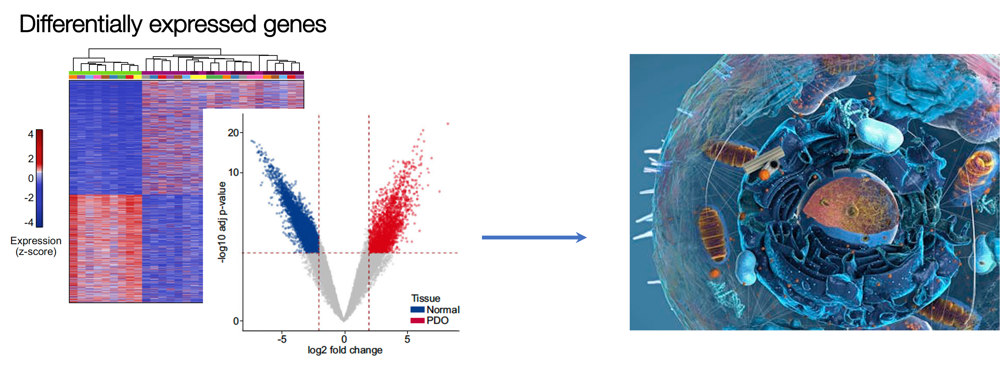
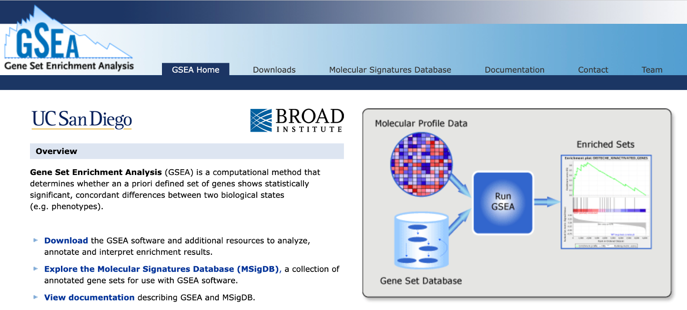
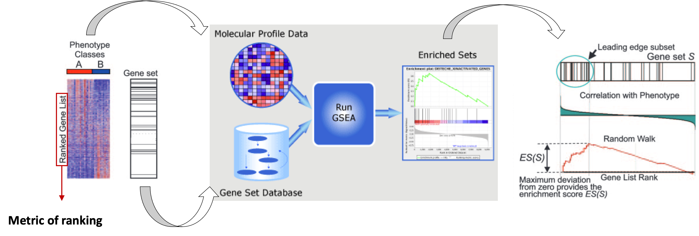
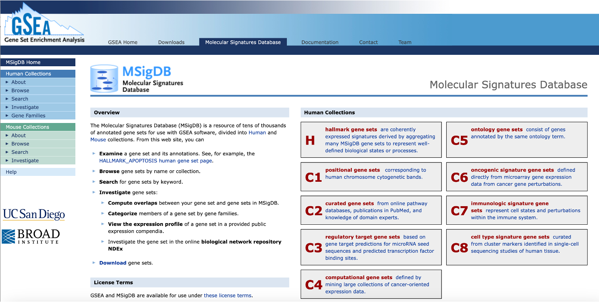
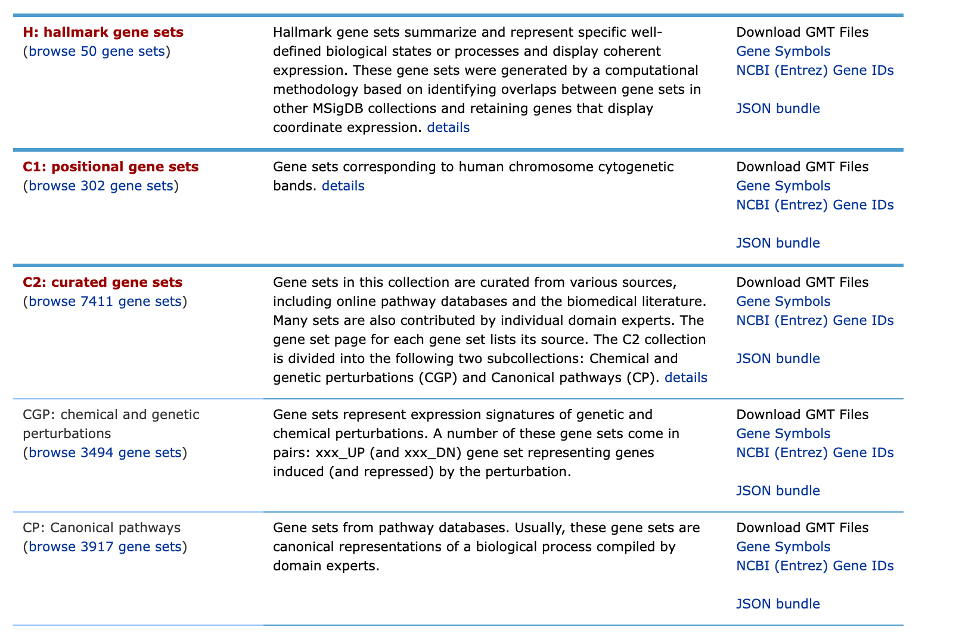

## Objectives

-   Downstream analysis of differential expression data
-   Gene ontology analysis on interesting gene groups
-   Gene set enrichment analysis (GSEA)


> Interpreting a long list of genes can be challenging because assessing each gene individually can not easily capture the key biological mechanisms underlying distinct phenotypes.


<center></center>


Various computational approaches have been developed to assess the broader biological context of findings from omics experiments.
Once we have our differentially expressed genes, we can perform downstream analyses to check the **functional aspects** of the group of genes which are up- or down-regulated in our condition of interest. In the following sections, we will go through two of these, Gene Set Enrichment Analysis (GSEA) and Gene Ontology Enrichment Analysis (GO).

We can then start addresing some interesting questions:
- *What is the function of the differentially expressed genes?*
- *What can they tell us regarding the molecular/phenotypic differences between our groups of interest?*
- *Do they belong to specific ontologies or pathways?*


## Import libraries

```{r setup, include=FALSE}
knitr::opts_chunk$set(engine = 'R', echo = TRUE, fig.align = 'center', warning = FALSE, message = FALSE, class.output = ".bordered")
library(kableExtra)
library(dplyr)
library(tidyr)
library(ggplot2)
library(tibble)
```


Let's upload the results file with information on the differential genes we generated.

Import these files as R objects
```{r, eval=TRUE}
res <- read.table('../results/res.deg.csv', sep='\t', header=T, row.names=1)
```


## Enrichment analysis using GSEA

Gene Set Enrichment Analysis - [GSEA](https://www.gsea-msigdb.org/gsea/index.jsp) is a computational methods that determines whether any *a priori* defined geneset shows statistically significant differences between two biological states (e.g. phenotypes).

  In other words...
  
  ...if it is enriched at the top of a list of genes ordered on the basis of expression differences between two groups


<center>

(*The web interface for GSEA*)

</center>


The following image adapted from the [original publication](https://www.pnas.org/doi/10.1073/pnas.0506580102) illustrates the main steps in GSEA.

<center></center>


To answer if members of a gene set occur towards the top or bottom of the ranked list of genes, we need:

1. ranked list of differentially expressed genes (e.g. based on logFold Change or P-value)
2. gene sets defined based on prior biological knowledge


### Ranked list of genes

We will perform **Pre-ranked GSEA** using all genes tested for differential analysis, ranked by their -log10(p-adjusted value) * the sign of the log2FoldChange, e.g. significantly upregulated genes are at the top of the rank whilst significantly downregulated ones are at the bottom. In our case, we want to check if a gene set of colorectal cancer in significantly enriched in the genes that are upregulated in our primary CRC samples. To run GSEA, we will use the `fgsea` package. 

```{r}
# Rank the genes based on their padj x sign(log2FC)

ranked <- res %>% 
  rownames_to_column(var="GeneID") %>%
  filter(!GeneID=="") %>%
  mutate(padjxFC=-log10(FDR)*sign(logFC)) %>%
  arrange(desc(padjxFC)) %>%
  pull(padjxFC, GeneID)
  
head(ranked)
tail(ranked)

```


```{r, include=FALSE}

# all <- read.table("../Mar24/Korg_Ntissue_results.txt", sep="\t", header=FALSE)
# colnames(all) <- c('chr', 'start', 'end', 'id', 'sign', 'baseMean', 'log2FoldChange', 'lfcSE', 'stat', 'pval', 'padj', 'padjxFC', 'region', 'annotation', 'Gene.Name', 'biotype', 'recurK', 'recurN')
# head(all)
# 
# # Rank the genes based on their padj x sign(log2FC)
# ranked <- all %>% 
#   filter(!is.na(Gene.Name) & !is.na(padj)) %>%
#   select(Gene.Name, log2FoldChange, padjxFC) %>%
#   mutate(abs = abs(padjxFC)) %>%
#   #arrange(desc(abs)) %>%
#   arrange(desc(padjxFC)) %>%
#   group_by(Gene.Name) %>% 
#   filter(row_number() == 1) %>% 
#   #arrange(desc(padjxFC)) %>%
#   #tibble::column_to_rownames('Gene.Name') %>%
#   #filter(Gene.Name=='ARHGEF16')
#   pull(padjxFC, Gene.Name)
#   
# length(ranked)
# head(ranked)
# tail(ranked)

```


### MSignDB signatures

We will first retrieve gene sets from the Molecular Signatures Database (MSigDB), a resource of tens of thousands of annotated gene sets for use with GSEA software, divided into Human and Mouse collections. 
In order to extract the gene set without the need to directly download it, we are going to access MSigDB directly from R using another package called msigdbr.

<center>

(*The web interface for MSigDB*)

</center>


There are 35,134 gene sets (number constantly increases) in the Human MSigDB that are divided into 9 major collections.

<center>

(*Human MSigDB Collections*)

</center>


Import libraries for fgsea and msigdbr 
```{r, eval=FALSE}
if (!require(fgsea, quiet=TRUE))
  BiocManager::install("fgsea")
```

```{r, eval=FALSE}
if (!require(msigdbr, quiet=TRUE))
  install.packages("msigdbr")
```


Extract the curated gene sets (C2) from the MSigDB database, subcollection Chemical and Genetic Perturbations.

It is very likely that the following code will crash your R session due to the limited resources provided by the Posit Cloud platform. This is why the code below is commented and, instead, you will upload the curated dataset (we have already extracted) from the course material.

```{r, eval=FALSE, include=TRUE}
options(timeout = 600) # Increase network timeout
library(msigdbr)
# Extract specific gene sets from the MSigDB database, e.g. Chemical and Genetic Pertubations
#curated_gsets <- msigdbr(species = "human", collection = "C2", subcollection = 'CGP') 
#saveRDS(curated_gsets, "../course_material/curated_gsets.rds")
```

```{r, eval=FALSE, include=FALSE}

options(timeout = 600) # Increase network timeout
library(msigdbr)
# Extract specific gene sets from the MSigDB database, e.g. Chemical and Genetic Pertubations
curated_gsets <- msigdbr(species = "human", collection = "C2", subcollection = 'CGP') |> dplyr::select(gs_name, gene_symbol, gs_description)

```


Load the `curated_gsets` dataset from the course material. Inspect the information and gene sets we retrieved. 
```{r}
curated_gsets <- readRDS('../course_material/curated_gsets.rds')
names(curated_gsets)
```


```{r}
curated_gsets %>% pull(gs_name) %>% unique() %>% head(2)
```


Check if there are any gene sets related to Colon Cancer.
```{r}
curated_gsets %>% filter(grepl('COLON_AND_RECTAL',gs_name)) %>% head() %>% kbl() %>% kable_styling()
```

```{r, include=FALSE}
# # Filter the oncogenic gene sets for the gene set of our interest
# gene_set_name <- "WNT_UP.V1_UP"
# tex_sig_df <- oncogenic_gsets %>% filter(gs_name == gene_set_name)
# tex_sig_df
```

We will filter the curated gene sets for the gene sets of our interest and then prepare a list retrieving the genes that are contained in each geneset (shown in the `gs_name` column). 

```{r}

# Filter the curated gene sets for the gene set of our interest
gene_set_name <- c("GRADE_COLON_AND_RECTAL_CANCER_UP", "GRADE_COLON_AND_RECTAL_CANCER_DN")

# Create an empty gene set list
gset <- list()

# For each gene set retrieve the gene symbols and store them in the gset list.

for (gs in gene_set_name) {
  
  # subset the table for a gene set
  tmp <- curated_gsets %>% filter(gs_name==gs)
  
  # retrieve gene symbols
  tmp_gset <- list(tmp$gene_symbol)    
  #names(tmp_gset) <- gene_set_name
  
  # add the genes in the gset list
  gset[gs] <- tmp_gset
}

```


```{r}
# Retrieve the number of genes in each element of the list
lapply(gset, length)
gset
```


Run GSEA on our ranked list of genes using the gene sets we retrieve from MSigDB. Here, we set the number of permutations to 1000.

```{r}

library(fgsea)
# Run GSEA
fgseaRes <- fgsea(pathways = gset, 
                  stats    = ranked,
                  nperm = 1000
                  )
```


Inspect the results for each geneset, which include the normalized enrichment score (NES) and nominal P-value using 1000 permutations.

```{r}
# Take a look at results
fgseaRes
```


Plot GSEA results
```{r, fig.width=6}
# Plot GSEA results

for (gs in unique(gene_set_name)){
  print(plotEnrichment(gset[[gs]],
               ranked) + labs(title=gs))
}

```

The GSEA results show that the **GRADE_COLON_AND_RECTAL_CANCER** genesets are enriched in the differentially upregulated and downregulated genes in our dataset. The geneset derives from a [study](https://www.gsea-msigdb.org/gsea/msigdb/human/geneset/GRADE_COLON_AND_RECTAL_CANCER_UP.html?ex=1), in which they used oligonucleotide microarrays to profile human rectal and colon carcinoma tumors compared to normal mucosa samples. 


> Can you retrieve the leading edge genes from the reuslts?

```{r, include=TRUE}
fgseaRes$leadingEdge
```


## Gene Ontology or Pathway Enrichment Analyses (over representation)


To obtain further **biological insights related to gene regulation** we can perform Gene Ontology or Pathway Enrichment analyses. We will try to get a more *unsupervised* look at what kind of biological processes are captured by the upregulated genes in primary CRC.

We will do this using the `gProfiler` package in `R`.

> **Gene Ontology** is a standardized system for **annotating genes with terms** describing their biological attributes.
> These terms are organized into three main categories: **Molecular Function** (the biochemical activity of the gene product), **Biological Process** (the broader biological objectives the gene contributes to), and **Cellular Component** (the location where the gene product is active).

The *enrichment* is evaluated in this way: a list of genes is compared against a background set of genes (e.g., all genes in the genome) to identify GO terms that are **significantly overrepresented in the list of interest**.


> Statistical tests, such as Fisher's exact test or hypergeometric test, are commonly used to determine whether the observed number of genes associated with a particular GO term in the gene list is significantly higher than expected by chance.

The output of GO enrichment analysis includes a list of significantly enriched GO terms along with statistical metrics, such as p-values or false discovery rates (FDR).

> This information helps to prioritize genes for further study and provides further context to the experimental results!


First, we will **create a custom function** that takes as input a list of genes and automatically run the `gProfiler` function responsible for calulating the enrichment and also creating two plots: one that generally describes the categories of enriched terms, and another one more specific for **enriched pathways from KEGG** (aka, *Kyoto Encyclopedia of Genes and Genomes*).


```{r}
#| code-fold: true
#| code-summary: "Code for running gprofiler and generating rank dot plots"

# Result data.frames will be stored in this object 
gprof <- c()

#genes: provide a character vector with gene names
#geneListName: a character identifying the list of genes that will be used to name the data.frame stored in res and to create the pdf

gprofiler <- function(genes, geneListName) {
  
  #Parameters you might want to change:
  #ordered_query: if the gene list provided is ranked 
  #evcodes: if you want to have the gene ids that intersect between the query and the term
  #custom_bg: the gene universe used as a background
  
  gostres <- gost(query =unique(as.character(genes)), 
                  organism = "hsapiens", ordered_query = FALSE, 
                  multi_query = FALSE, significant = TRUE, exclude_iea = FALSE, 
                  measure_underrepresentation = FALSE, evcodes = TRUE , 
                  user_threshold = 0.05, correction_method = "g_SCS", 
                  domain_scope = "annotated", custom_bg = NULL, 
                  numeric_ns = "", sources = NULL, as_short_link = FALSE)
  
  # Create the overview plot (not interactive)
  gostplot <- gostplot(gostres, capped = TRUE, interactive = F)
  
  # Keep only useful columns
  gp_mod <- gostres$result[,c("query", "source", "term_id",
                             "term_name", "p_value", "query_size", 
                             "intersection_size", "term_size", 
                             "effective_domain_size", "intersection")]
  gp_mod$query <- geneListName
  
  # Calculate GeneRatio for the dotplot: number of genes intersecting the term/ total number of unique genes provided
  gp_mod$GeneRatio <- gp_mod$intersection_size/gp_mod$query_size
  
  # Number of genes within the term / number of all unique genes across all terms (universe)
  gp_mod$BgRatio <- paste0(gp_mod$term_size, "/", gp_mod$effective_domain_size)
  
  # Rename columns
  names(gp_mod) <- c("Cluster", "Category", "ID", "Description", "p.adjust", "query_size", "Intersection_size", "term_size", "effective_domain_size", "intersection", "GeneRatio", "BgRatio")
  
  # Save the results data.frame in res
  gprof[[geneListName]] <<- gp_mod
  
  # Remove possible duplicate terms for plotting
  
  gp_mod %>% group_by(Description) %>% 
    filter(row_number() == 1)
  
  # omit_ids <- gp_mod[duplicated(gp_mod$Description), ]
  # omit_ids_list <- omit_ids$Description
  # gp_mod <- gp_mod[!gp_mod$Description %in% omit_ids_list,]
  
  
  go_table_pathways <- filter(gp_mod, Category %in% c('KEGG'))
  
  # Calculate negLog P-Value and rank terms based on this value  
  go_table_pathways$negLogPval=-log10(go_table_pathways$p.adjust)
  go_table_pathways <- go_table_pathways[order(-go_table_pathways$negLogPval),]
  
  # Make dot plot
  dotPlot <- arrange(go_table_pathways, negLogPval) %>%
    group_by(Description) %>% 
    filter(row_number() == 1) %>%
    ungroup()
  
  dotPlot <- arrange(go_table_pathways, negLogPval) %>%
    mutate(Description = factor(.$Description, levels = .$Description)) %>%
    ggplot(aes(negLogPval, Description)) +
    geom_point(aes(color = negLogPval, size = GeneRatio))+
    scale_size(range = c(5, 9)) +
    scale_color_gradient(low="blue", high="red")+
    theme_light()+
    ylab('Pathway')+
    theme(axis.text.y=element_text(size = 10),
          axis.text.x=element_text(size = 7),
          legend.text = element_text(size = 7),
          legend.title = element_text(face = 'bold'))

# Print on display
return(list(gostplot, dotPlot))
}

```


Now, let's extract a *vector* of genes up-regulated in tumor samples, and perform the analysis:

```{r}
# Extract upregulated genes
up_genes_all <- res %>%
  filter(FDR < 0.01 & logFC > 1) %>%
  arrange(FDR) %>%
  rownames()

```

We can check the number of genes that we have retrieved.

```{r}
paste("Number of tumor upregulated genes:", length(up_genes_all))

paste0("Top differentially expressed genes:", paste(head(up_genes_all, 10), collapse = ", "))

```


We can now run the function created above to obtain our enriched biological pathways.

```{r}
# Load package
library(gprofiler2)

# Run custom function
gprofiler(genes = up_genes_all, geneListName = 'genes_up')
```


Here, interestingly, we find that the two most enriched biological pathways is "Hippo signalling pathway".

From this insight we can start to **generate new hypotheses**, like the one tested in the study about the relevance of YAP/TAZ factors, which are indeed key downstream effectors of the Hippo signalling.

> 💡 GO analyses might highlight very interesting patterns and generate hypotheses, but are many times quite hard to interpret depending also on the biological system we are studying.


> What information did we retrieve from the analysis? 

All information is stored in the *genes_up* table

```{r}
gprof$genes_up %>% colnames()
```


```{r}

gprof$genes_up %>% head(5) %>% kbl() %>% kable_styling()

```
We can summarize the number of hits for each pathway category

```{r}
gprof$genes_up %>% group_by(Category) %>% tally()

table(gprof$genes_up$Category)
```


Let's retrieve the KEGG pathways
```{r}

gprof$genes_up %>% filter(Category=="KEGG") %>% head(6) %>% kbl() %>% kable_styling()

```


Can you retrieve the differentially expressed genes that are part of the Hippo signaling pathway?

```{r, echo=FALSE}
gprof$genes_up %>% filter(Description=='Hippo signaling pathway') %>% pull(intersection)
```

```{r, echo=FALSE}
gprof$genes_up %>% filter(Description=='TNF signaling pathway') %>% pull(intersection)
```


Run enrichment analysis for genes downregulated in tumor samples

```{r}
# Extract upregulated genes
down_genes_all <- res %>%
  filter(FDR < 0.01 & logFC < -1) %>%
  arrange(FDR) %>%
  rownames()

paste("Number of tumor downregulated genes:", length(down_genes_all))

paste0("Top differentially expressed genes:", paste(head(down_genes_all, 10), collapse = ", "))

```


```{r}
# Run again custom function
gprofiler(genes = down_genes_all, geneListName = 'genes_down')

```

```{r}
# What class is gprof?
class(gprof)
# What are the dimensions of the elements in gprof?
lapply(gprof, dim)
```


>
> 🤔 What analysis would you perform to show that PDOs resemble the *ex vivo* tumor samples?
>


> 💡 You can use another tool for pathway enrichment analysis callsed `clusterProfiler`.

```{r, include=FALSE}
#significant = output only significant
#correction_method = appropriate for query lists, since GO terms are not independent
#domain scope = Statistical domain size N describes the total number of genes used for random selection and is one of the #four parameters for the hypergeometric probability function of statistical significance used in g:GOSt. Only genes with #at least one annotation to be part of the domain.

```


```{r, eval=FALSE, include=TRUE}
# suppressPackageStartupMessages(
#   BiocManager::install("clusterProfiler")
#    BiocManager::install("org.Hs.eg.db")
# )

```


```{r, eval=FALSE, include=TRUE}
# #library(org.Hs.eg.db)
# library(clusterProfiler)

# ontology="MF"
# 
# # Perform gene ontology enrichment
# ego <- enrichGO(gene         = up_genes_all,
#                 OrgDb         = org.Hs.eg.db,
#                 keyType       = 'ENSEMBL',
#                 ont           = ont, # Molecular Function, use "BP" or "CC" for Biological Process or Cellular Component
#                 pAdjustMethod = "BH",
#                 pvalueCutoff  = 0.05,
#                 qvalueCutoff  = 0.05,
#                 readable      = TRUE)
```

```{r, eval=FALSE, include=TRUE}
#head(ego)
```


```{r, eval=FALSE, include=TRUE}
# Plot results of gene ontology enrichment
#goplot(ego, firstSigNodes=10)
```


Let’s now plot the results with a ranked dotplot. 
Gene ontology terms are ranked from the top to the bottom based on the Gene Ratio (number of genes intersecting the term / total number of unique genes provided). The significance of the enrichment (p.adjust) is depicted by the color, whilst the size of the dot represents the number of genes in our geneset (e.g. up-regulated genes) that overlap the specific GO term. 

```{r, eval=FALSE, include=TRUE}
dotplot(ego, showCategory=20) + ggtitle(paste0("Dotplot for GO-", ontology, "enrichment")
```


## Take-home Messages 🏠

**Congratulations!**
You got the end of the course and now hopefully know some crucial aspects of a RNA-seq analysis workflow!
Some of the key concepts that we have explored during the course can enable us to reach some distilled points of interest:

-   Design your experiments carefully with data analysis in mind!

-   Data needs to be carefully explored to avoid systematic errors in the analyses!

-   Plot and Visualize as much as possible!

-   Not all information is useful, remember that it all depends on the biological question!

-   Omics outputs are immensely rich and one experiment can be used to answer a plethora of questions!
  
  