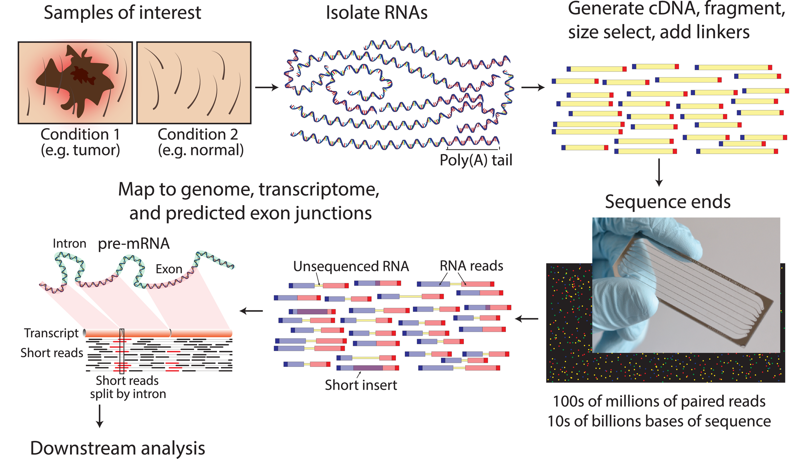
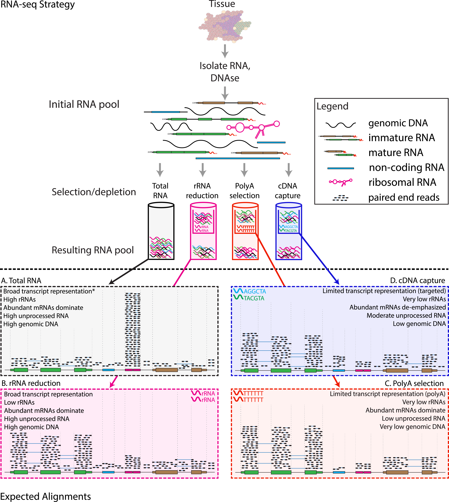
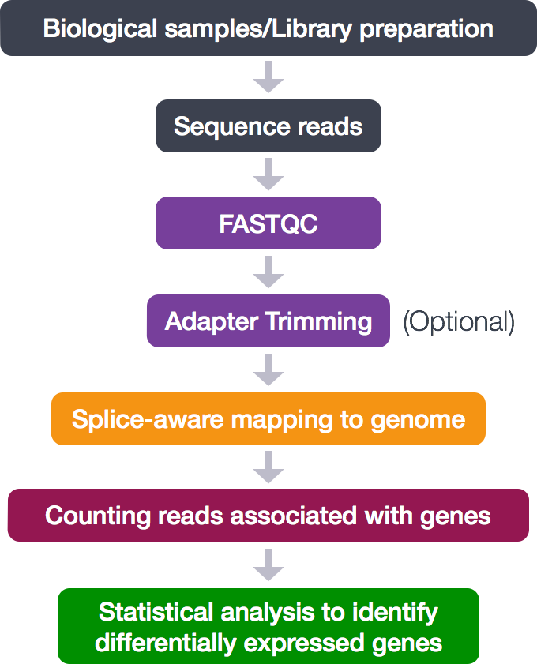

```{r setup, include=FALSE}
library(kableExtra)
knitr::opts_chunk$set(engine = 'R', echo = TRUE, fig.align = 'center', warning = FALSE, message = FALSE, class.output = ".bordered")
```

## *Omics* experiments

'Omics' as disciplines **work to** **answer questions** regarding specific 'omes'.
These questions are enabled by omics experiments; in most cases, these will be **sequencing- or mass-spectrometry based**.

A standard RNA-seq workflow begins with RNA extraction from the samples of interest, followed by library preparation and high-throughput sequencing to generate hundreds of millions of short paired-end reads.
These reads are then aligned to a reference genome or transcriptome, after which downstream analyses are performed, including expression quantification, differential expression analysis, transcript isoform identification, and enrichment analyses.

<center>

{width="500"}  

[*RNA-seq experimental workflow*](https://journals.plos.org/ploscompbiol/article?id=10.1371/journal.pcbi.1004393)

</center>


The identification of a suitable experimental model, types and numbers of samples, the process of extraction and purification of our target 'ome', and finally its conversion into a product that can be sequenced, i.e. **a *library***, **shape the final bioinformatic dataset** and **place limits on the possible questions** we will be able to ask of it.

> For example, in the case of RNA-seq, phenol-based extraction and precipitation will yield results that are not always comparable with total RNA extraction with a spin column.
> As a result, mixing extraction methods within the same study can introduce technical bias that confounds biological interpretation.
> In addition, the contingent decision to perform ribodepletion or enrichment for polyadenylated transcript will have an impact even on simple gene expression analyses.

> In other words, RNA extraction method matters because different methods recover different populations of RNA, which can affect downstream results.

<center>

{width="500"}

[*Strategies for library enrichment*](https://journals.plos.org/ploscompbiol/article?id=10.1371/journal.pcbi.1004393)

</center>

Summing up, an Omics experiment is designed starting from a question, selecting the sample(s), wet lab procedure and library preparations that will enable the most truthful, informative dataset to be built.

## Next Generation Sequencing

NGS technologies (Illumina/PacBio/Ultima/BGI) allow the processing of millions of synthesis reactions **in parallel**, resulting in high throughput, higher sensitivity, speed and reduced cost compared to first generation sequencing technologies (e.g., Sanger method).

> Given the vast amounts of quantitative sequencing data generated, NGS-based methods rely on resource-intensive **data processing pipelines** to analyze data.

In addition to the sequence itself, and unlike Sanger sequencing, the high-throughput nature of NGS provides **quantitative** information (depth of coverage) due to the high level of sequence redundancy at a locus.

There are short-read and long-read NSG approaches.
Short reads of NGS range in size **from 75 to 300 bp** depending on the application and sequencing chemistry.
NGS is taken to mean second generation technologies, however 3G and 4G technologies have since evolved (enable longer read sequences in excess of **10 kilobases**).

Among 2G NGS chemistries, Illumina **sequencing by synthesis** (SBS) is the most widely adopted worldwide, responsible for generating more than 90% of the world's sequencing data.

<center>

<div>


</div>

## RNA-seq data processing

### Raw Sequencing Reads

The **raw output** of any sequencing run consists of a series of sequences (called *tags* or ***reads***).
These sequences can have varying length based on the run parameters set on the sequencing platform.
Nevertheless, **they are made available for humans to read under a standardized file format known as FASTQ**.
This is the universally accepted format used to encode sequences after sequencing.
An example of real FASTQ file with only two ***reads*** is provided below.

```{r eval=FALSE}
@Seq1
AGTCAGTTAAGCTGGTCCGTAGCTCTGAGGCTGACGAGTCGAGCTCGTACG
+
BBBEGGGGEGGGFGFGGEFGFGFGGFGGGGGGFGFGFGGGFGFGFGFGFG
@Seq2
TGCTAAGCTAGCTAGCTAGCTAGCTAGCTAGCTAGCTAGCTAGCTAGC
+
EEEEEEEEEEEEEEEEEEEEEEEEEEEEEEEEEEEEEEEEEEEEEE
```

**FASTQ files are an intermediate file in the analysis** and are used to assess quality metrics for any given sequence.
The **quality of each base call** is encoded in the line after the `+` following the standard [**Phred score**](https://en.wikipedia.org/wiki/Phred_quality_score) system.

> 💡 **Since we now have an initial metric for each sequence, it is mandatory to conduct some standard quality control evaluation of our sequences to eventually spot technical defects in the sequencing run early on in the analysis.**

### Quality metrics inspection

Computational tools like [FastQC](https://www.bioinformatics.babraham.ac.uk/projects/fastqc/) aid with the [**visual inspection of per-sample quality metrics**](https://www.bioinformatics.babraham.ac.uk/projects/fastqc/Help/3%20Analysis%20Modules/) from NGS experiments.
Some of the QC metrics of interest to consider include the ones listed below, on the **left** are optimal metric profiles while on the **right** are sub-optimal ones:

**Per-base Sequence Quality**: This uses **box plots** to highlight the per-base quality along all **reads in the sequencing experiment, we can notice a physiological drop in quality towards the end part of the read**.

**Per-sequence Quality Scores**: Here we are plotting the **distribution of Phred scores** across all identified sequences, we can see that the high quality experiment (left) has a peak at higher Phred scores values (34-38).

**Per-base Sequence Content**: Here we check the sequence (read) base content, in a normal scenario we do not expect any dramatic variation across the full length of the read since we should see a quasi-balanced distribution of bases.

**Per-sequence GC Content**: GC-content refers to the **degree at which guanosine and cytosine are present within a sequence**, in NGS experiments which also include PCR amplification this aspect is crucial to check since GC-poor sequences may be enriched due to their easier **amplification bias**.
In a normal random library we would expect this to have a bell-shaped distribution such as the one on the left.

**Sequence Duplication Levels**: This plot shows the degree of sequence duplication levels.
In a normal library (left) we **expect to have low levels of duplication** which can be a positive indicator of high sequencing coverage.

**Adapter Content**: In NGS experiments we use **adapters** to create a library.
Sometimes these can get sequenced accidentally and end up being part of a **read**.
This phenomenon can be spotted here and corrected using a computational approach called **adapter trimming**.

### Trimming

The **read trimming** step consists of removing a variable portion of read extremities that contain adapters/have suboptimal quality indicated by the Phred score.
Tools like `Cutadapt` can be used to perform this task after read QC, and FASTQC can be eventually run just after read trimming to double-check positive effect of getting rid of bad sequences.
Note that after this step, reads might have different lengths.

### Read alignment

Now that we have assessed the quality of the sequencing data, we are ready to align the reads to the **reference genome** in order to **map the exact chromosomal** location they derive from.

> A reference genome is a set of nucleic acid sequences assembled as a representative example of a species' genetic material.
> It does not accurately represent the set of genes of any single organism, but a *mosaic* of different nucleic acid sequences from each individual.
> For each model organism, **several possible reference genomes may be available** (e.g. hg19 and hg38 for human).
>
> As the cost of DNA sequencing falls, and new full genome sequencing technologies emerge, more genome sequences continue to be generated.
> New alignments are built and the reference genomes improved (fewer gaps, fixed misrepresentations in the sequence, etc).
> The different reference genomes correspond to the different released versions (called "**builds**").

A mapper tool takes as input a reference genome and a set of reads.
Its aim is to **match each read sequence with the reference genome sequence**, allowing mismatches, indels and clipping of some short fragments on the two ends of the reads.

<center>

**Illustration of the mapping process**


</center>

Among the different mappers, `Bowtie2` is a fast and open-source aligner particularly good at aligning sequencing reads of about 50 up to 1,000s of bases to relatively long genomes.

Bowtie2 can identify reads that are:

1.  **uniquely mapped**: read pairs aligned exactly 1 time

2.  **multi-mapped**: reads pairs aligned more than 1 time

3.  **unmapped**: read pairs non concordantly aligned or not aligned at all

> Multi-mapped reads can happen because of repetition in the reference genome (e.g. multiple copies of a gene), particularly when reads are small.
> It is difficult to decide where these sequences come from and therefore **most of the pipelines ignore them**.

#### Mapping statistics

Checking the mapping statistics is an important step to perform before to continue any analyses.
There are several potential **sources for errors in mapping**, including (but not limited to):

-   PCR artifacts: PCR errors will show as mismatches in the alignment

-   sequencing errors

-   error of the mapping algorithm due to repetitive regions or other low-complexity regions.

A **low percentage of uniquely mapped reads** is often due to (i) either excessive amplification in the PCR step, (ii) inadequate read length, or (iii) problems with the sequencing platform.

> **70% or higher** is considered a good percentage of uniquely mapped reads over all the reads, whereas 50% or lower is concerning.
> The percentages are not consistent across different organisms, thus the rule can be flexible!

But where the read mappings are stored?

#### The BAM file format

A BAM (Binary Alignment Map) file is a *compressed binary file* storing the read sequences, whether they have been aligned to a reference sequence (e.g., a chromosome), and if so, the position on the reference sequence at which they have been aligned.

A BAM file (or a SAM file, the non-compressed version) consists of:

-   A **header section** (the lines starting with \@) containing *metadata*, particularly the chromosome names and lengths (lines starting with the @SQ symbol)

-   An **alignment section** consisting of a table with 11 mandatory fields, as well as a variable number of optional fields.

<center>**BAM file format** </center>

Questions:

```{r}
#| code-fold: true
#| code-summary: "Which information do you find in a BAM file that you also find in the FASTQ file?"

# Sequences and quality information
```

```{r}
#| code-fold: true
#| code-summary: "What is the additional information compared to the FASTQ file?"

# Mapping information, Location of the read on the chromosome, Mapping quality, etc
```

### Counting reads 

Once reads are aligned, the next step is to **count the number of sequencing reads that overlap each gene**.
This read counting process provides **quantitative information** about the expression level of a gene.

> Uniquely mapped reads can be counted within genes or transcripts using tools like `RSEM`.

> Stranded or unstranded RNA-seq libraries determine how reads that map two overlapping genes/exons are treated.

Sample counts for all genes are output as a tabular file, in which **each row represents one gene**, and you have **one column for each sample**.
We will load one such dataset and take a closer look: this will be our starting point in the *hands-on* analysis of a RNA-seq dataset.

> The following scheme summarizes the steps of a RNA-seq analysis workflow that we discussed so far.

The graph below illustrates the main steps of the RNA-seq analysis workflow.

<center>

{width="300"}

</center>
