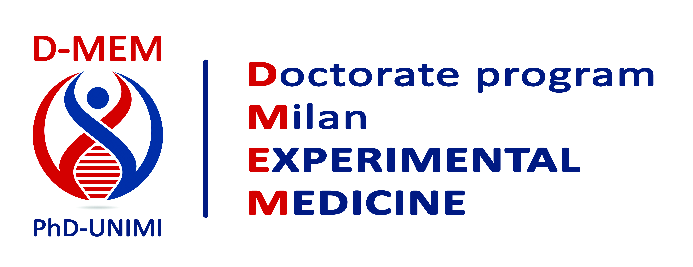

```{r setup, include=FALSE}
knitr::opts_chunk$set(engine = 'R', echo = TRUE, fig.align = 'center', warning = FALSE, message = FALSE)
```

**Welcome!** This page has been created for the purposes of the [course](https://dms.ariel.ctu.unimi.it/v5/Home/default.aspx) ["*Pipelines and tools for omics data analyses (cycle 39)*"](https://www.unimi.it/en/education/postgraduate-and-continuing-education-programmes/doctoral-programmes-phd/phd-courses-list/ay-2025/2026-pipelines-and-tools-omics-data-analyses) which is organized as part of the [Doctorate/PhD Program in Experimental Medicine](https://d-memphd.unimi.it/).



The aim is to introduce you to bioinformatics and to some of the most important concepts related to the **analysis of Next Generation Sequencing (NGS) data**.

You will be guided through the analytical workflows of **RNA-seq** datasets.
The hands-on part is based on `R` and for this reason an essential introduction to this programming language will be provided as well.

The RNA dataset used in this workshop is taken from [our study](https://www.nature.com/articles/s41467-021-22544-y#MOESM1) published on *Nature Communications* in 2021, "*Epigenomic landscape of human colorectal cancer unveils an aberrant core of pan-cancer enhancers orchestrated by YAP/TAZ*".
Part of the exercises will be dedicated to reproducing some relevant analyses and plots published as results!

# Learning Objectives

1.  Familiarize with basic R functionalities
2.  Get an overview of the RNA-seq assay and its significance in genomic research
3.  Describe applications and key insights derived from RNA-seq experiments
4.  Understand the core steps of a RNA-seq data analysis pipeline

# Workshop Schedule

This workshop is intended as a two-day tutorial.
Each day will be dedicated to specific activities:

### Introduction

-   Introduction to R and RStudio
-   Install, and use R packages and functions
-   Work with tidyverse packages such as dplyr and ggplot
-   Load files and save R objects
-   Inspect and manipulate a dataframe using dplyr
-   Create plots to visualize data using ggplot2

### Part 1

-   Introduction to RNA-seq
-   Dataset introduction and exploration
-   Data normalization with `edgeR`
-   Diagnostic and exploratory analysis
-   Perform differential analysis using `edgeR`
-   Visualize the results

### Part 2

-   Downstream analyses of differentially expressed genes
-   Perform gene ontology analysis on interesting gene groups
-   Perform gene set enrichment analysis

# Credits

This workshop was inspired by other tutorials on RNA-seq data analysis ([the Bioconductor course](https://www.bioconductor.org/help/course-materials/2016/CSAMA/), the teaching material from the [HBC training](https://hbctraining.github.io/Intro-to-bulk-RNAseq/schedule/links-to-lessons.html), the tutorials from the [NGS Leraning lab](https://ngs101.com/tutorials/). For the R fundamentals part look at this [R book for beginners](https://bookdown.org/daniel_dauber_io/r4np_book/) and the training courses at [Babraham Bioinformatics](https://www.bioinformatics.babraham.ac.uk/training.html). **Mattia Toninelli** ([mattia.toninelli\@ifom.eu](mailto:mattia.toninelli@ifom.eu){.email}) and **Carolina Dossena** ([carolina.dossena\@ifom.eu](mailto:carolina.dossena@ifom.eu){.email}) helped with the development of this site and course sections.

# License

All of the material in this course is under a [Creative Commons Attribution license](https://creativecommons.org/licenses/by/4.0/) (*CC BY 4.0*) which permits unrestricted use, distribution, and reproduction in any medium, provided the original author and source are credited.
